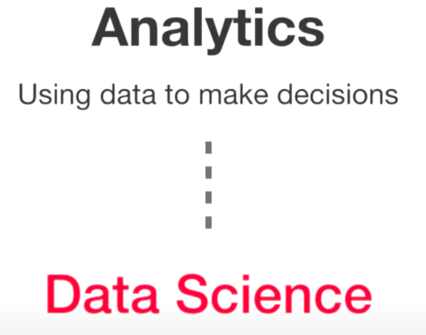

# [nlp-py-tutorial](https://github.com/c-w-m/nlp-py-tutorial) Presentation Slides

Inspect an element in Chrome browser using shortcut `Ctrl+shift+C`

The current page has 

# References
## Tutorial
* video [Natural Language Processing in Python](https://www.youtube.com/watch?v=xvqsFTUsOmc)
* abstract [Natural Language Processing in Python by Alice Zhao](https://www.pyohio.org/2018/schedule/presentation/38/)
* original code [nlp-in-python-tutorial](https://github.com/adashofdata/nlp-in-python-tutorial)

